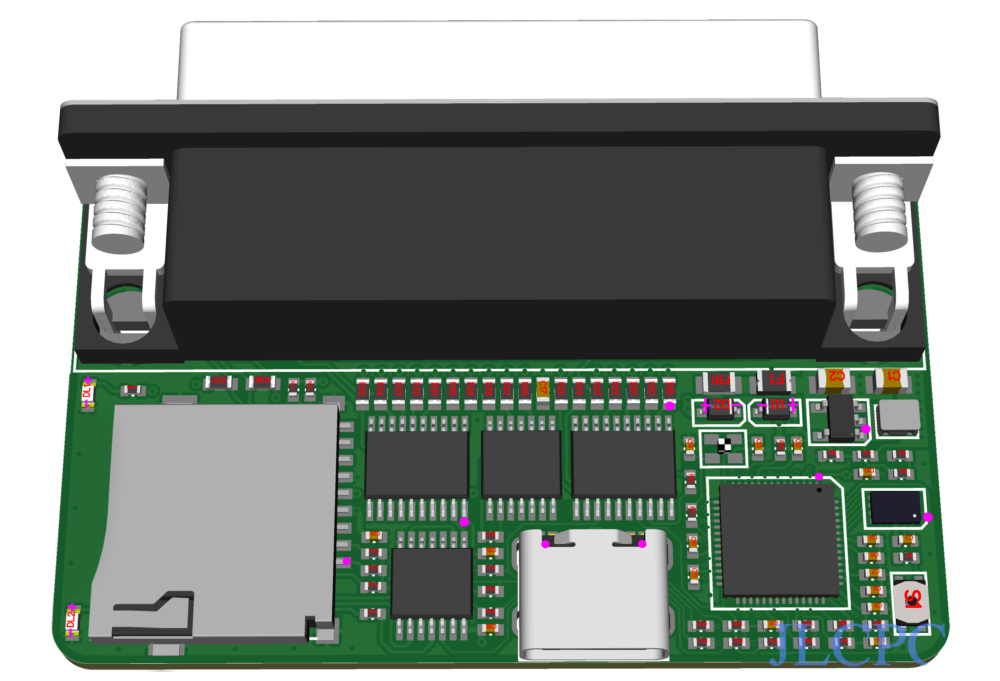

# SCSIknife Pocket

SCSIknife Pocket - The SCSI jump drive.

SCSIknife Pocket is a ZuluSCSI™ PICO OSHW derivative, compatible with the ZuluSCSI™ PICO firmware.



SCSIknife Pocket is an extremely compact SCSI disk drive emulator designed to be plugged externally to a computer or SCSI enabled device.

# Hardware

SCSIknife Pocket require 5.0VDC ± 0.5V which can be supplied by the SCSI termination or USB-C. SCSIknife Pocket is available in DB25, HD50 or Centronics50 version.

SCSI DB25 connector is male, but can be replaced with DB25 female if soldered on the underside of the board. The same apply for other connector types.

# Firmware

SCSIknife Pocket is 100% compatible with the ZuluSCSI™ PICO firmware.
As such, flashing instructions can be found [there](https://github.com/ZuluSCSI/ZuluSCSI-firmware)

To update the firmware, download the universal `.zip` archive and place it on a SD card, firmware will be updated at power up.
Alternatively, place the PICO version of the `.bin` file on the SD card. Do not use the RP2040 or any RP2350 based versions.
If for some reason SCSIknife is unresponsive or if the wrong firmware is flashed, restore by pressing and holding the “Bootloader” button before plugging in the USB C connection to a computer. SCSIknife will appear as a drive on the desktop. Drop the PICO firmware file in `.uf2` format on the disk and SCSIknife will automatically update and disconnect itself upon completion. 

# Gerber generation

This PCB was designed with Adobe Illustrator, and exported as SVG files.

These SVG files are then converted to Gerber using the following tools:
* [Gerbolyze](https://github.com/jaseg/gerbolyze)
* [svg-to-gerber](https://github.com/Altomare/svg-to-gerber): gerbolyze wrapper + drill file generation

If you need to re-generate gerbers:
```shell
# Illustrator uses 72 DPI instead of the usual 96 for SVG files
svg-to-gerber.py SCSIknife/svg SCSIknife/gerber 72

# If you end up with a negative gerber on some layers, 
# re-run the svg-flatten command seen in logs without -f.
# It seems to behave differently on different setups
```

# License and disclaimer

SCSIknife Pocket is based on ZuluSCSI™ PICO OSHW, which can be found here:
* [ZuluSCSI™ Pico OSHW](https://github.com/ZuluSCSI/ZuluSCSI-Pico-OSHW)
* [ZuluSCSI™ Firmware](http://github.com/ZuluSCSI/ZuluSCSI-firmware)

ZuluSCSI™ is a registered trademark of Rabbit Hole Computing.
Rabbit Hole Computing is not responsible for the SCSIknife hardware and does not provide technical support and troubleshooting regarding SCSIknife related issues.

SCSIknife Pocket inherits the CERN-OHL-S-2.0 license from ZuluSCSI Pico

See [license.txt](LICENSE.txt)
